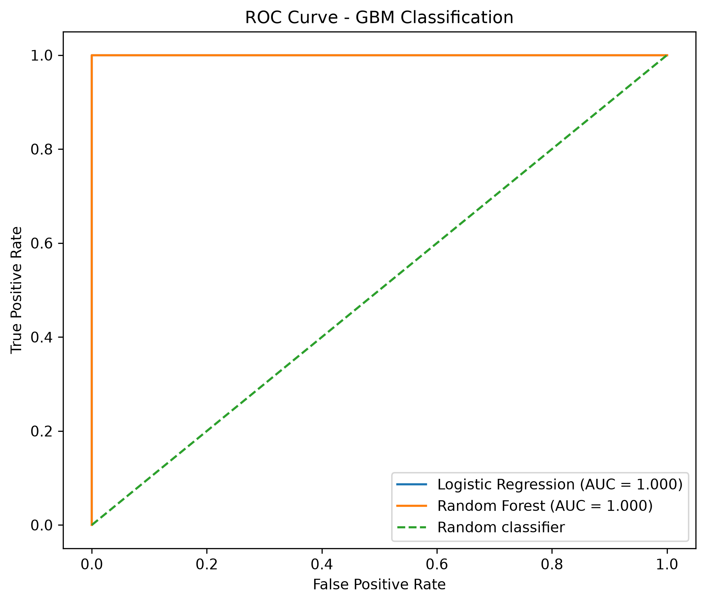
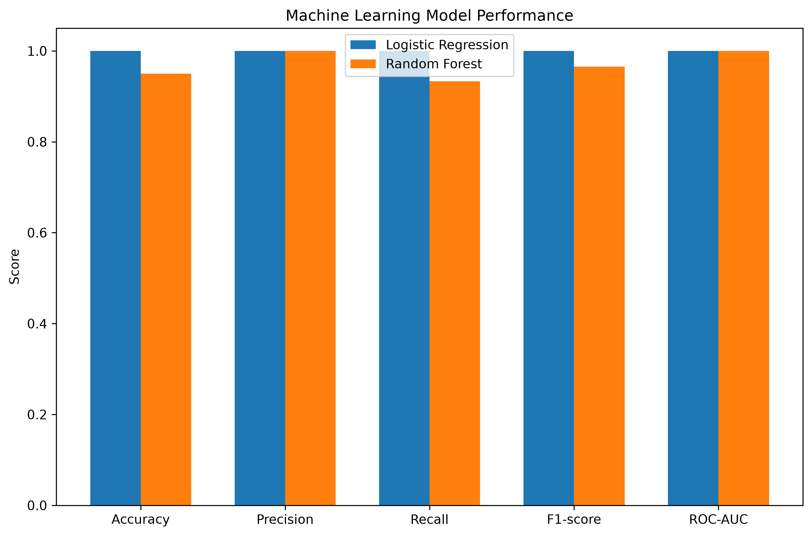
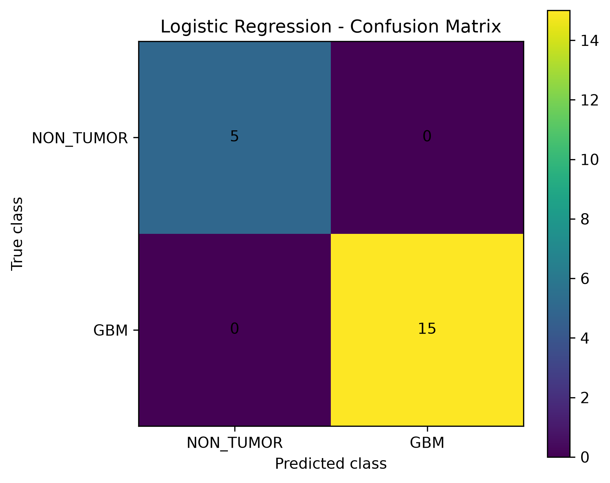
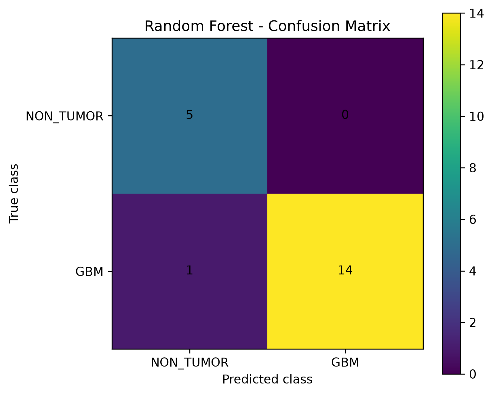
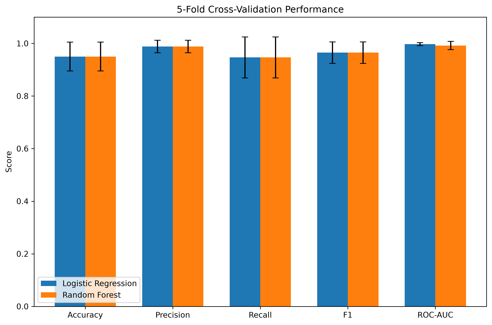
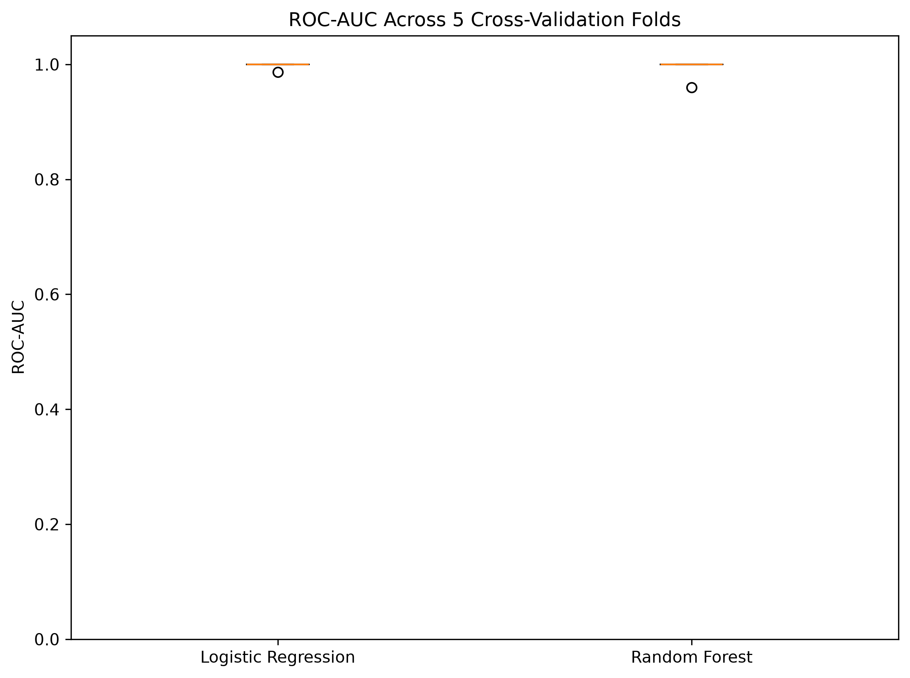

# Machine Learning Classification of Glioblastoma (GBM)


---

# Project Overview

This project presents a **machine learning workflow for classification of glioblastoma (GBM) and non-tumor brain samples** using gene expression data.

The analysis was performed in **Python** using the **scikit-learn** machine learning framework.

The aim of the project was to investigate whether gene expression profiles can be used to distinguish glioblastoma samples from non-tumor brain samples.

The workflow includes gene expression preprocessing, probe annotation, gene-level aggregation, feature selection, machine learning classification, model evaluation, and cross-validation.

---

# Analysis Pipeline

```text
                 GSE4290 (GEO)
                        │
                        ▼
          Affymetrix expression matrix
                 54,613 probes
                        │
                        ▼
              Sample selection
          GBM vs Non-Tumor samples
                        │
                        ▼
              GPL570 annotation
                        │
                        ▼
              Probe → Gene mapping
                        │
                        ▼
             Gene-level expression
                 22,189 genes
                        │
                        ▼
                Feature Selection
                  Top 100 genes
                        │
              ┌─────────┴─────────┐
              ▼                   ▼
      Logistic Regression    Random Forest
              │                   │
              └─────────┬─────────┘
                        ▼
                 Model Evaluation
                        │
          ┌─────────────┴─────────────┐
          ▼                           ▼
    Test Set Evaluation       5-Fold Cross-Validation
          │                           │
          └─────────────┬─────────────┘
                        ▼
                 Performance Metrics
          Accuracy / Precision / Recall
              F1-score / ROC-AUC
```

---

# Biological Question

**Can gene expression profiles be used to distinguish glioblastoma (GBM) from non-tumor brain samples using machine learning?**

---

# Dataset

| Information | Value |
|-------------|-------|
| Database | Gene Expression Omnibus (GEO) |
| Accession | GSE4290 |
| Organism | *Homo sapiens* |
| Platform | Affymetrix Human Genome U133 Plus 2.0 Array |
| Platform ID | GPL570 |
| Data type | Gene expression microarray |
| Total samples | 100 |
| GBM samples | 77 |
| Non-tumor samples | 23 |
| Original probes | 54,613 |
| Genes after annotation | 22,189 |
| Selected features | 100 |

Dataset:

https://www.ncbi.nlm.nih.gov/geo/query/acc.cgi?acc=GSE4290

The original GEO expression data are not included in this repository.

---

# Bioinformatics Workflow

- Download GSE4290 expression matrix from GEO
- Select GBM and non-tumor samples
- Inspect sample diagnostic information
- Load GPL570 annotation
- Map Affymetrix probes to gene symbols
- Aggregate multiple probes corresponding to the same gene
- Generate a gene-level expression matrix
- Select the 100 most informative genes
- Create a stratified training and test set
- Train Logistic Regression classifier
- Train Random Forest classifier
- Evaluate classification performance
- Generate confusion matrices
- Generate ROC curves
- Compare model performance
- Perform 5-fold stratified cross-validation
- Compare model stability across validation folds

---

# Machine Learning Methods

## Feature Selection

The gene-level expression matrix contained **22,189 genes**.

Because the number of genes was much larger than the number of samples, feature selection was performed using:

**SelectKBest + ANOVA F-test (`f_classif`)**

The **100 highest-ranking genes** were selected as features for classification.

Feature selection was incorporated into the machine learning pipeline to reduce the risk of information leakage during cross-validation.

---

## Logistic Regression

Logistic Regression was used as a linear classification model.

The selected gene expression features were standardized before model training.

The model was used to determine whether a linear relationship between gene expression patterns and the diagnostic groups could distinguish GBM from non-tumor samples.

---

## Random Forest

Random Forest was used as a nonlinear classification model based on an ensemble of decision trees.

The model was used to determine whether more complex relationships between gene expression features could improve classification performance.

---

# Results

## Test Set Performance

The dataset was divided using a stratified train/test split:

- Training set: 80 samples
- Test set: 20 samples

| Model | Accuracy | Precision | Recall | F1-score | ROC-AUC |
|--------|----------|-----------|--------|----------|---------|
| Logistic Regression | **1.00** | **1.00** | **1.00** | **1.00** | **1.00** |
| Random Forest | 0.95 | 1.00 | 0.93 | 0.97 | 1.00 |

Logistic Regression correctly classified all 20 samples in the test set.

Random Forest correctly classified 19 out of 20 test samples.

---

## Cross-Validation

To assess model performance across multiple data partitions, **5-fold stratified cross-validation** was performed.

| Model | Accuracy | Precision | Recall | F1-score | ROC-AUC |
|--------|----------|-----------|--------|----------|---------|
| Logistic Regression | 0.950 ± 0.055 | 0.988 ± 0.024 | 0.947 ± 0.078 | 0.965 ± 0.041 | **0.997 ± 0.005** |
| Random Forest | 0.950 ± 0.055 | 0.988 ± 0.024 | 0.947 ± 0.078 | 0.965 ± 0.041 | **0.992 ± 0.016** |

Logistic Regression achieved a slightly higher and more stable ROC-AUC than Random Forest during cross-validation.

---

# Visual Results

## ROC Curve

The ROC curve compares the classification performance of Logistic Regression and Random Forest across different classification thresholds.



---

## Model Performance Comparison

The model comparison summarizes the main classification metrics obtained on the test set.



---

## Logistic Regression – Confusion Matrix

The confusion matrix shows the classification results obtained by Logistic Regression on the test set.



---

## Random Forest – Confusion Matrix

The confusion matrix shows the classification results obtained by Random Forest on the test set.



---

## Cross-Validation Performance

The cross-validation comparison shows the performance of both machine learning models across the five validation folds.



---

## ROC-AUC Cross-Validation

The ROC-AUC plot illustrates the stability of model performance across the five cross-validation folds.



---

# Main Findings

The machine learning analysis demonstrated that gene expression profiles can effectively distinguish glioblastoma from non-tumor samples within the GSE4290 dataset.

Both Logistic Regression and Random Forest achieved high classification performance.

Logistic Regression achieved the strongest cross-validation performance, with a mean ROC-AUC of:

**0.997 ± 0.005**

Random Forest achieved:

**0.992 ± 0.016**

The results indicate that the selected gene expression features contain strong information associated with the distinction between GBM and non-tumor samples.

---

# Skills Demonstrated

This project demonstrates practical experience with:

- Gene expression data analysis
- Microarray data preprocessing
- Affymetrix probe annotation
- Probe-to-gene mapping
- Gene-level feature construction
- Statistical feature selection
- Machine learning classification
- Logistic Regression
- Random Forest
- Train/test splitting
- Stratified cross-validation
- Model performance evaluation
- ROC-AUC analysis
- Confusion matrix visualization
- Scientific data visualization in Python
- Reproducible machine learning workflows
- Python programming
- Linux / WSL
- Git & GitHub project organization

---

# Technologies

- Python 3.11
- pandas
- NumPy
- scikit-learn
- matplotlib
- seaborn
- PyYAML
- NCBI GEO
- Affymetrix GPL570

---

# Future Improvements

Possible extensions of this project include:

- Validation using an independent GBM dataset
- Hyperparameter optimization
- Comparison with Support Vector Machines
- Gradient Boosting or XGBoost classification
- Recursive feature elimination
- Biological interpretation of selected genes
- Pathway enrichment analysis of machine learning features
- Survival analysis using independent clinical datasets

---

# Repository Structure

```text
04-Machine-Learning-GBM
│
├── data
│   └── raw
│
├── figures
│   ├── confusion_matrix_logistic_regression.png
│   ├── confusion_matrix_random_forest.png
│   ├── ROC_curve_models.png
│   ├── model_performance_comparison.png
│   ├── cross_validation_model_comparison.png
│   └── cross_validation_ROC_AUC.png
│
├── results
│   ├── model_performance.csv
│   ├── cross_validation_summary.csv
│   ├── cross_validation_fold_results.csv
│   ├── selected_features.csv
│   ├── train_test_split.csv
│   └── test_predictions.csv
│
├── scripts
│   ├── 01_prepare_data.py
│   ├── 02_feature_selection.py
│   ├── 03_train_models.py
│   ├── 04_evaluate_models.py
│   └── 05_external_validation.py
│
├── .gitignore
├── LICENSE
└── README.md
```

---

# Reproducibility

The project was developed using **Python 3.11** in a dedicated Conda environment under **Linux/WSL**.

Create the environment:

```bash
conda create -n ml-gbm python=3.11
conda activate ml-gbm
```

Install the required packages:

```bash
pip install pandas numpy scikit-learn matplotlib seaborn pyyaml
```

Download the GSE4290 expression matrix and GPL570 annotation from GEO and place them in:

```text
data/raw/
```

Run the analysis scripts sequentially:

```bash
python scripts/01_prepare_data.py
python scripts/02_feature_selection.py
python scripts/03_train_models.py
python scripts/04_evaluate_models.py
python scripts/05_external_validation.py
```

---

# Limitations

The analysis was performed on a relatively small dataset containing **100 samples**.

The classes are also imbalanced, with more GBM samples than non-tumor samples.

The very high classification performance should therefore be interpreted in the context of this particular dataset.

The models are not clinically validated.

Independent external validation using a separate dataset would be required to determine whether the observed performance generalizes to other patient cohorts.

---

# Author

**Katarzyna Zielińska**

Bioinformatics Portfolio

2026

Created as part of a Bioinformatics Portfolio project focused on machine learning applications in cancer genomics.
